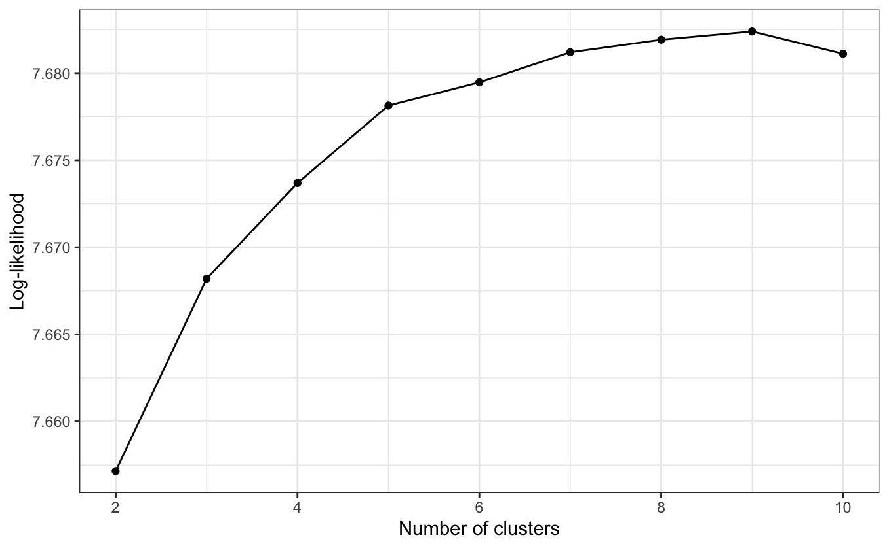
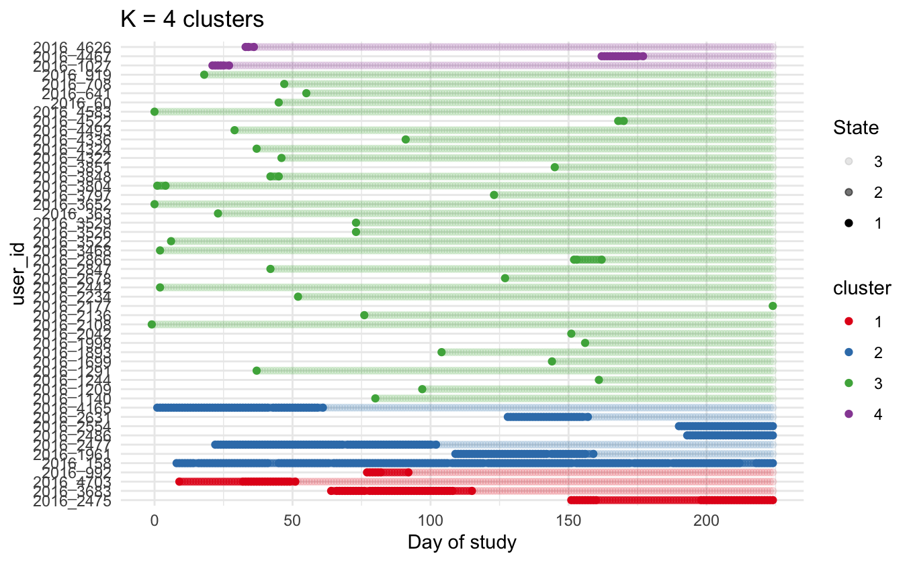

```{r setup, include=FALSE}
knitr::opts_chunk$set(echo = TRUE)

library(tidyverse)
library(lubridate)
library(sf)
library(ggspatial)
library(gganimate)
library(ggstatsplot)
library(patchwork)

df <- read_csv(here::here("Data",
                          "base_file_all_final.csv"))

# Prescription data from https://openprescribing.net/bnf/030401/

presc <- read_csv(here::here("Data",
                             "spending-by-ccg-030401.csv"))

# CCG boundary data from https://geoportal.statistics.gov.uk/datasets/d6acd30ad71f4e14b4de808e58d9bc4c/explore

ccgs  <- st_read(here::here("Data",
                           "Clinical_Commissioning_Groups_(April_2021)_EN_BUC",
                           "Clinical_Commissioning_Groups_(April_2021)_EN_BUC.shp")) %>%
  mutate(CCG21NM = toupper(CCG21NM))
```

# Introduction:

Citizen science is an increasingly popular approach to research in the social sciences. However, concerns surrounding the quality of data produced by citizen scientists hinder further adoption of citizen science approaches (Aceves-Bueno, et al. 2017; Basiri, et al. 2019; Elliott & Rosenberg, 2019; Lukyanenko, et al. 2016; Riesch & Potter, 2014).

Identifying and removing low quality and careless responses is essential for the both the credibility of the data, and for valid inferences to be made (Huang, 2018; Johnson & Sieber, 2013; Ternovski, 2022; McGonagle, et al. 2016). Huang (2018) demonstrates that insuffecient effort responses can have a confounding effect on variables of interest... Ternovski argues that inattentive respondents may be introducing "substantial measurement error and attenuation bias" (2022: 1). Furthermore, in a power analysis they found that almost four times more participants were needed to achieve 80% power when no screening for attention was implemented.

In response to these concerns, approaches have been developed to mitigate concerns around data quality in citizen science studies, such as the implementation of quality assurance standards and protocols (Minghini, et al. 2017; Fonte, et al. 2017; Samulowska, et al, 2021).

However, these approaches are not universally applicable and are often developed in contexts where there is a relatively large amount of information about both participants, their contribution history, and the object or phenomena about which they are collecting data. For example, approaches that leverage large amounts of redundancy in the data collection or classification approach (Balázs, et al. 2021; Lintott et al. 2008), or approaches where strong priors about the distribution of likely observations enable the flagging of unlikely reports for further investigation (Salganik, 2019; Kelling et al. 2012).

For some approaches, such as studies using experience sampling methodology (ESM) which typically focus on generating data about the subjective experiences of participants, these approaches are difficultly applicable.

Given the difficulties in applying standard data quality protocols to ESM data, the most common approach used in these situations has been to use the number of reports submitted as a proxy for the quality of the data, on the assumption that quality and quantity are associated, since both the attentiveness with which reports were completed and the number of reports completed are assumed to be at least partially determined by a participant's underlying motivation (Doherty, et al. 2020; Geerharts, 2021). Jaso, et al (2021) note that, for EMA/ESM studies, the " closest "best-practice" standard for cleaning data is the tendency to remove participants who do not meet an a-priori compliance cut off defined by the percent of surveys completed " (3).

However, excluding participants has several potential downsides, including "rejecting legitimate responses, reducing power, and reducing sample's representativness"XXX (Ternovski ,2022)

However failing to remove careless responses also presents downsides. Ternovski conducts a power analysis, finding that almost four times more participants were needed to achieve 80% when ...

# Methods:

## Data

This paper uses data from the Britain Breathing project and from OpenPrescribing.net .

*Britain breathing data:*

The Britain Breathing project is a citizen science study which takes an experience sampling approach to collecting geolocated time series data on seasonal pollen allergy symptoms, also referred to as allergic rhinitis or hayfever (Vigo, et al. 2018).

Users of the app can report symptoms at any time, and also at daily scheduled intervals. When they make a report, they are first asked how they are feeling. If they respond that they are feeling well, no further questions are asked, if they respond otherwise, they are asked further questions about the severity of various symptoms ("nose", "eyes, and "breathing"), which they report on a four point scale ranging from 0, which signifies an absence of symptoms, to 3, which indicates severe symptoms.

Available further information includes the gender of participants, their date of birth, known allergies, whether or not they are taking antihistamine medication, and the date, time, and location of each report submitted.

The data has good geographical coverage, with reports submitted from 95% of all postcode areas in the UK, with the average number of reports per postcode being 167 (idem: 89).

Three versions of the application were deployed, v2016, v1 and v2.

```{r, echo = FALSE}

df %>% 
  ggplot(aes(x = date,
             fill = as_factor(version)))+
  geom_histogram(bins = 250, col = "grey", size = 0.1)+
  scale_x_date(date_breaks = '6 months')+
  scale_y_continuous(breaks = seq(0, 1825, 250))+
  scale_fill_manual(values=c("orange", "yellow","green4" ))+
  theme_bw()+
  theme(axis.text.x = element_text(angle = 45, vjust = 0.5, hjust=1))+
  labs(fill = "Version:", x = "", y = "Number of reports")

```

A common feature of crowdsourced data is high levels of participation inequality (Hackley, 2016). This feature can be seen in the Britain Britain data.

```{r, echo = FALSE, warning = FALSE}

df %>%
  group_by(user_id) %>% 
  filter(row_number()==1) %>%
  ggplot(aes(x = duration_days)) +
  geom_histogram(bins = 50, col = "grey", size = 0.1)+
  theme_minimal()+
  scale_y_log10()+
  scale_x_log10()+
  labs(x = "Number of days in the study",
       y = "Number of participants")


```

**XXXX I've chosen to use a log log plot here, I think this is appropriate, and the graph is hard to read otherwise, but Covid hasn't filled me with confidence that academics are actually any good at reading logscales XXXX**

*NHS England prescription data:*

As a means of validating the data collected using the Britain Breathing app, Vigo, et al (2018) look at the correlation between the median lack of wellness reported on the Britain Breathing app and the number of antihistamines prescribed by general practitioners, finding that they are very strongly (r = 0.93) correlated. This data is openly available from OpenPrescribing.net.

## Procedure

### *Separating data into years*

Data is available from April 2016 to April 2021.

....

### *Clustering by level of engagement*

The way in which engagement is understood and operationalised varies a lot between scholars and fields (Perski, et al. 2017, Yardley, et al. 2016). This paper seeks to establish how sensitive the impact of removing disengaged users is to the way engagement is operationalised.

*Threshold methods*

Jaso, et al (2021) describe a general trend in the EMA/ESM literature to only include participants with a 70%--90% compliance rate, highlighting that this is often selected by convention and not empirically determined (2021:3). For example Sun, et al (2020) consider participants who completed less than 10 assessments to be unengaged, and excluded them for their analysis.

A more data driven approach is found in a study by Kronkvist and Engstrom (2020), who split their participants into *abstainers*, who completed zero assessments, *dedicated participants* who completed a number of assessments one standard deviation or more above the average number of assessments completed by participants, and *occasional participants* who did not meet the criteria for the two previous groups.

*Hidden Markov models*

Druce, et al (2017) argue such approaches overlook the complexity of patterns of engagement. For example a participant may be strongly engaged with the app for a week, carefully filling in assessments every day, before having to cease contributing for various reasons. Under the approaches described above such contributions would not be labeled as highly engaged (and potentially excluded from analysis) for either missing a threshold such as 10 contributions, or for being below some deviation from the mean number of contributions.

Instead, they propose using first order hidden Markov models...

Participants were coded as engaged on a given day if they made at least one contribution to the app. This variable was assumed to be the result of participants being in one of three latent states of engagement

*Comparing with prescription data*

Data on antihistamine prescriptions is available from OpenPrescribing at the Clinical Commissioning Group (*CCG*) level. To enable comparisons with Britain Breathing data, reports were assigned to the CCG areas in which they were submitted using the sf package (Pebesma, 2018).

Vigo, et al (2018)... **XXXX I started to write up what had been done in vigo et al here before outlining what i planned to do, but it's not actually clear what was done in the original paper XXXX**

\<---- Note: Amount vs Quantity

From the Open prescribe website:

"*Items* counts the number of times a medicine has been prescribed. It says nothing about how much of it has been prescribed (for that see [quantity](https://openprescribing.net/faq/#prescquantity)) as some presciptions will be for many weeks' worth of treatment while others will be much smaller.

*Quantity* is the total amount of a medicine that has been prescribed, but the units used depend on the particular form the medicine is in"

I'm not sure exactly which variable to use here, items would seem to indicate how often people go to the doctor with Hayfever problems, quantity is the amount that has been prescribed, which I would assume is more to do with the gp's personal preferences than the patients? (my personal experience with hayfever has been to just buy over the counter loratadine, rather than go through the NHS, which can take weeks)

\
\<----

*Looking at indicators of carelessness*

# Data analysis

### Clusterings

**XXXX I just did year one so far XXXX**

```{r, include=FALSE}
dfy1 <- df %>%
  filter(version == "v2016")

```

*Simple clusterings*

The most common way of operationalising engagement is using contribution thresholds (Jaso, et al. 2021).

```{r, echo = FALSE}
p1 <- dfy1 %>%
  group_by(user_id) %>%
  count() %>%
  ungroup() %>% 
  mutate(engagement_threshold = if_else(n > 1, "high", "low")) %>%
  ggplot(aes(x = engagement_threshold))+
  geom_bar()+
  scale_y_continuous(breaks = seq(0, 5000, 500),
                     limits = c(0, 5000))+
  labs(x = "Engagement (threshold = 1)", y = "Number of participants")+
  theme_minimal()

p2 <- dfy1 %>%
  group_by(user_id) %>%
  count() %>%
  ungroup() %>% 
  mutate(engagement_threshold = if_else(n > 3, "high", "low")) %>%
  ggplot(aes(x = engagement_threshold))+
  geom_bar()+
  scale_y_continuous(breaks = seq(0, 5000, 500),
                     limits = c(0, 5000))+
  labs(x = "Engagement (threshold = 3)", y = "Number of participants")+
  theme_minimal()

p3 <- dfy1 %>%
  group_by(user_id) %>%
  count() %>%
  ungroup() %>% 
  mutate(engagement_threshold = if_else(n > 5, "high", "low")) %>%
  ggplot(aes(x = engagement_threshold))+
  geom_bar()+
  scale_y_continuous(breaks = seq(0, 5000, 500),
                     limits = c(0, 5000))+
  labs(x = "Engagement (threshold = 5)", y = "Number of participants")+
  theme_minimal()

p4 <- dfy1 %>%
  group_by(user_id) %>%
  count() %>%
  ungroup() %>% 
  mutate(engagement_threshold = if_else(n > 10, "high", "low")) %>%
  ggplot(aes(x = engagement_threshold))+
  scale_y_continuous(breaks = seq(0, 5000, 500),
                     limits = c(0, 5000))+
  geom_bar()+
  labs(x = "Engagement (threshold = 10)", y = "Number of participants")+
  theme_minimal()

(p1 | p2 ) /
(p3 | p4)
```

```{r, include=FALSE}

dfy1%>%
  group_by(user_id) %>%
  count() %>%
  ungroup() %>%
  summarise(mean = mean(n),
            stdev = sd(n))
```

Kronkvist and Engstrom (2020) split their participants into abstainers, who completed zero assessments, dedicated participants who completed a number of assessments one standard deviation or more above the average number of assessments completed by participants, and occasional participants who did not meet the criteria for the two previous groups. The mean number of contributions by participants in the first year of the study was \~4 and the standard deviation \~ 13.

```{r, echo=FALSE}
df %>%
  group_by(user_id) %>%
  count() %>%
  ungroup() %>% 
  mutate(engagement_kron = if_else(n > 17, "high", "low")) %>%
  ggplot(aes(x = engagement_kron))+
  geom_bar()+
  theme_minimal()+
  labs(x = "Engagement", y = "Number of participants")
```

*Hidden Markov Models*

A hidden Markov model was fit to the participants following the process described above.

```{r}
yr1_k4 <- readRDS(file = here::here("Clusterings", "yr1_k4"))
     
yr1_k4_clusters <- readRDS(file = here::here("Clusterings", "yr1_k4_clusters" ))   
```

Using the elbow heuristic for detecting the optimal number of clusters we find that 4 clusters is optimal.

**XXXX We don't actually find this at all this time, this is just the most common result (there are also other reasons, mostly ease of interpretations, and consistency with the cloudy paper, why this is preferable) XXXX**



|       |     |      |
|:------|:----|:-----|
| **1** | 1   | 526  |
| **2** | 2   | 475  |
| **3** | 3   | 3460 |
| **4** | 4   | 287  |

50 particiants were sampled from the study and plotted with their assigned states and cluster.



Visually we can distinguish four reporting behaviors high (cluster 1, 526/4748), medium (cluster 2, 475/4784), low (cluster 4, 278/4784), and tourist (cluster 3, 3460/4748).

```{r}

counts_by_cluster <- dfy1 %>%
  group_by(user_id) %>%
  count() %>%
  ungroup() %>% 
  left_join(yr1_k4_clusters,by = "user_id")

counts_by_cluster %>% 
  ggplot(aes(x = cluster))+
  geom_bar()+
  scale_y_continuous(breaks = seq(0, 3500, 500),
                     limits = c(0, 3500))+
  labs(x = "Cluster", y = "Number of participants")+
  theme_minimal()

#
#counts_by_cluster %>% 
#  group_by(cluster) %>% 
# summarise(mean = mean(n),
#           median = median(n))
```

### Correlation analysis

NHS prescription data is available from OpenPrescribing.net. However this data is only available for prescriptions made in England. Reports made outside of England (1697, or \~8.4% of reports) were therefore removed from the data, as they could not be linked to prescription data.

```{r}

#Joining the cluster data with the prescription data

dfy1_all_clusters <- dfy1 %>%
  group_by(user_id) %>%
  count() %>%
  ungroup() %>% 
  mutate(engagement_threshold_1 = if_else(n > 1, "high", "low"),
         engagement_threshold_3 = if_else(n > 3, "high", "low"),
         engagement_threshold_5 = if_else(n > 5, "high", "low"),
         engagement_threshold_10 = if_else(n > 10, "high", "low"),
         engagement_kron = if_else(n > 17, "high", "low")) %>% 
  left_join(yr1_k4_clusters,by = "user_id") %>% 
  dplyr::select(-prob.1,
          -prob.2,
          -prob.3,
          -prob.4,
          -n) %>% 
  left_join(dfy1,by = "user_id")%>%
  st_as_sf(coords = c("longitude", "latitude"),
           agr = "constant",
           crs = "WGS84") %>%
  st_transform(crs = 27700)%>%
  st_intersection(ccgs) %>% 
  st_join(ccgs, left = FALSE) %>% 
  mutate(ccg = CCG21NM.y)

dfy1_all_clusters %>%
  filter(ccg != "NHS VALE ROYAL CCG") %>% 
  group_by(ccg, lubridate::month(date)) %>%
  summarise(reports = n(),
            mean_wellbeing = mean(how_im_doing)) 


presc %>%
  filter(date())
%>% 
  right_join(presc, by = c("ccg" ="row_name" ))


```

# Results

# Discussion

\newpage

# References

Aceves-Bueno, E., Adeleye, A. S., Feraud, M., Huang, Y., Tao, M., Yang, Y., & Anderson, S. E. (2017). The accuracy of citizen science data: a quantitative review. *Bulletin of the Ecological Society of America*, *98*(4), 278-290.

Basiri, A., Haklay, M., Foody, G., & Mooney, P. (2019). Crowdsourced geospatial data quality: Challenges and future directions. *International Journal of Geographical Information Science*, *33*(8), 1588-1593.

Balázs, B., Mooney, P., Nováková, E., Bastin, L., & Arsanjani, J.J (2021). "Data Quality in Citizen Science" in Vohland, K., Land-Zandstra, A., Ceccaroni, L., Lemmens, R., Perelló, J., Ponti, M., ... & Wagenknecht, K. *The science of citizen science*. Springer Nature.

Brovelli, M. A., Minghini, M., Molinari, M., & Mooney, P. (2017). Towards an automated comparison of OpenStreetMap with authoritative road datasets. *Transactions in GIS*, *21*(2), 191-206.

Druce, K. L., McBeth, J., van der Veer, S. N., Selby, D. A., Vidgen, B., Georgatzis, K., ... & Dixon, W. G. (2017). Recruitment and ongoing engagement in a UK smartphone study examining the association between weather and pain: cohort study. JMIR mHealth and uHealth, *5*(11), e168.

Elliott, K. C., & Rosenberg, J. (2019). Philosophical foundations for citizen science. *Citizen Science: Theory and Practice*, *4*(1).

Fonte, C.C., Antoniou, V., Bastin, L., Estima, J., Arsanjani, J.J., Bayas, J.C.L., See, L. and Vatseva, R. (2017). Assessing VGI data quality. *Mapping and the citizen sensor*, 137-163.

Haklay, M. E. (2016). Why is participation inequality important?. Ubiquity Press.

Jaso, B. A., Kraus, N. I., & Heller, A. S. (2021). Identification of careless responding in ecological momentary assessment research: From posthoc analyses to real-time data monitoring. Psychological Methods.

Johnson, P. A., & Sieber, R. E. (2013). Situating the adoption of VGI by government. In *Crowdsourcing geographic knowledge* (pp. 65-81). Springer, Dordrecht.

Kronkvist, K., & Engström, A. (2020). Feasibility of gathering momentary and daily assessments of fear of crime using a smartphone application (STUNDA): Methodological considerations and findings from a study among Swedish university students. *Methodological Innovations*, *13*(3), 2059799120980306.

Lukyanenko, R., Parsons, J., & Wiersma, Y. F. (2016). Emerging problems of data quality in citizen science. *Conservation Biology*, *30*(3), 447-449.

McGonagle, A. K., Huang, J. L., & Walsh, B. M. (2016). Insufficient effort survey responding: An under‐appreciated problem in work and organisational health psychology research. *Applied Psychology*, *65*(2), 287-321.

Minghini, M., Antoniou, V., Fonte, C.C., Estima, J., Olteanu-Raimond, A.M., See, L., Laakso, M., Skopeliti, A., Mooney, P., Jokar Arsanjani, J. and Lupia, F. (2017). "The relevance of protocols for VGI collection." in

OpenPrescribing.net ( *2022). The DataLab, University of Oxford.* Available online: <https://openprescribing.net> Last accessed: XXXX

Pebesma, E. J. (2018). Simple features for R: standardized support for spatial vector data. *R J.*, *10*(1), 439.

Perski, O., Blandford, A., West, R., & Michie, S. (2017). Conceptualising engagement with digital behaviour change interventions: a systematic review using principles from critical interpretive synthesis. *Translational behavioural medicine*, *7*(2), 254-267.

Riesch, H., & Potter, C. (2014). Citizen science as seen by scientists: Methodological, epistemological and ethical dimensions. *Public understanding of science*, *23*(1), 107-120.

Samulowska, M., Chmielewski, S., Raczko, E., Lupa, M., Myszkowska, D., & Zagajewski, B. (2021). Crowdsourcing without Data Bias: Building a Quality Assurance System for Air Pollution Symptom Mapping. *ISPRS International Journal of Geo-Information*, *10*(2), 46.

Sun, J., Rhemtulla, M., & Vazire, S. (2020). Eavesdropping on Missing Data: What Are University Students Doing When They Miss Experience Sampling Reports?. Personality and Social Psychology Bulletin, 0146167220964639.

Ternovski, J., & Orr, L. (2022). A Note on Increases in Inattentive Online Survey-Takers Since 2020. *Journal of Quantitative Description: Digital Media*, *2*.

Vigo, M., Hassan, L., Vance, W., Jay, C., Brass, A., & Cruickshank, S. (2018). Britain Breathing: using the experience sampling method to collect the seasonal allergy symptoms of a country. *Journal of the American Medical Informatics Association*, *25*(1), 88-92.

Yardley, L., Spring, B. J., Riper, H., Morrison, L. G., Crane, D. H., Curtis, K., ... & Blandford, A. (2016). Understanding and promoting effective engagement with digital behaviour change interventions. *American journal of preventive medicine*, *51*(5), 833-842.

# Supplementary materials:

The code for this project is available at <https://github.com/NathanKhadaroo/BB_Paper>.

The data for this project is not publicly available due to its potentially sensitive nature; however, researchers may request access from **XXXX who? XXXX**
